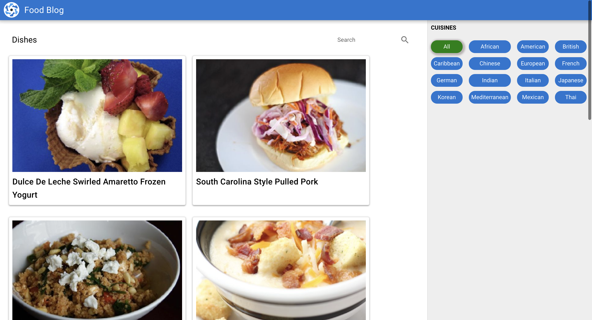

# Quasar FoodBlog App

Welcome to the Quasar FoodBlog app! This application allows users to explore different dishes based on cuisine tags, view dish details including ingredients and instructions, and filter dishes using a search feature. The app fetches recipes from the Spoonacular API using Axios and utilizes Vuex for state management. You can run the app online by visiting [FoodBlog](https://webofdeva-foodblog.netlify.app/#/type/all).




## Features

- **Cuisine Tags:** Explore different dishes based on cuisine tags such as Italian, Mexican, Indian, etc.
- **Dish Details:** Click on a dish to view its details including ingredients and instructions.
- **Search:** Filter dishes using a search feature to find specific recipes.
- **API Integration:** Fetch recipes from the Spoonacular API to populate the app with a wide range of dishes.
- **State Management:** Utilize Vuex for managing application state and data.

## Technologies Used

- **Quasar Framework:** A Vue.js framework for building responsive web apps.
- **Vuex:** A state management pattern and library for Vue.js applications.
- **Axios:** A promise-based HTTP client for making API requests.
- **Spoonacular API:** An API for fetching recipes and food-related data.

## Installation and Setup

## Install the dependencies
```bash
npm install
```

### Start the app in development mode (hot-code reloading, error reporting, etc.)
```bash
quasar dev
```

### Lint the files
```bash
npm run lint
```

### Build the app for production
```bash
quasar build
```

